# sai — dog walking & pet care, native iOS

SwiftUI client for [sai-fastapi](https://github.com/nickspopov/sai-fastapi) (FastAPI + GraphQL). Tracks walks with live GPS, keeps a pet care calendar (walks, food, pills, vet, grooming), and shows daily/weekly/monthly activity stats. Started in August 2023 as a side project to learn SwiftUI + Apollo iOS properly; the architecture is deliberately "textbook" clean (Domain / Data / Presentation) so it doubles as a reference.

<p align="center">
  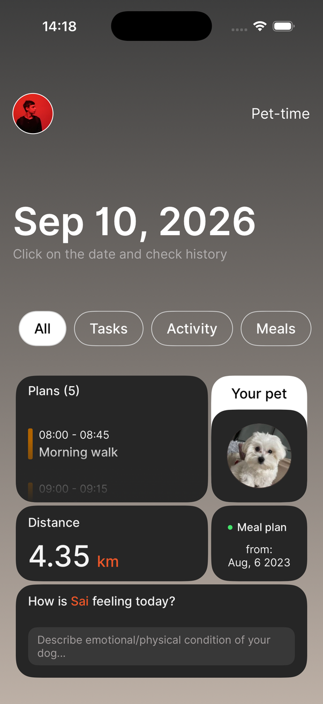
  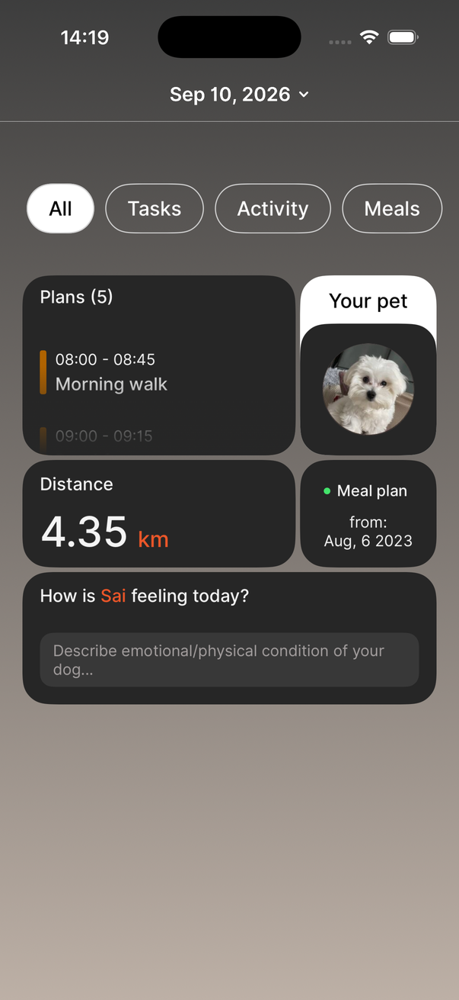
  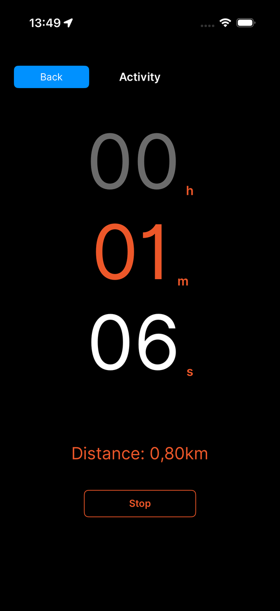
</p>

## What it does

- **Live walk tracking** — `LocationService` (CoreLocation) streams coordinates into `ActiveWalkService`; the walk is buffered locally in CoreData (`WalksDBImpl`) and uploaded with its full interval history on finish. Distance is computed server-side from the intervals (haversine), so the client only ships raw GPS points.
- **Activity stats** — today / week / month / year aggregates (distance, duration, average speed and pace) through one GraphQL query (`getWalkIntervalActivityByDay`) instead of pulling every walk.
- **Pet care calendar** — typed events (walking, food, pills, grooming, vet, other) with date navigation and a create-event sheet; the backend schedules push notifications for them.
- **Community** — join a walker community around a place; server-side check-in jobs.
- **Home sheet UI** — the home screen is a persistent, non-dismissable `.sheet` with custom detents over an animated header. Dragging the sheet drives the header animation via a preference key that reports the sheet's Y position. The sheet chrome is made fully transparent through `SwiftUIIntrospect` (`UISheetPresentationController`), including the Liquid Glass material on iOS 26.
- **Firebase auth** — email/password sign-in; the ID token is attached to every Apollo request by an interceptor.

## Screenshots

| | | |
|---|---|---|
|  Home (All) |  Sheet expanded, header collapsed | 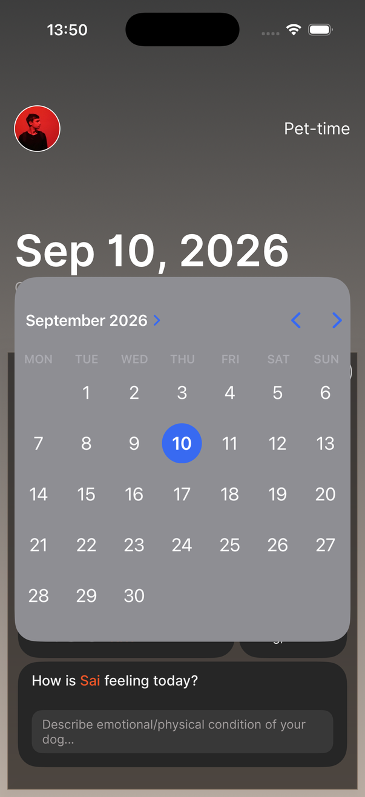 Date picker |
| 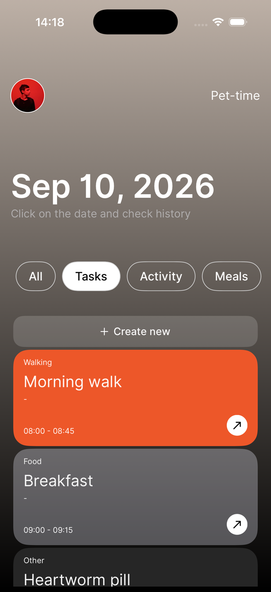 Tasks tab | 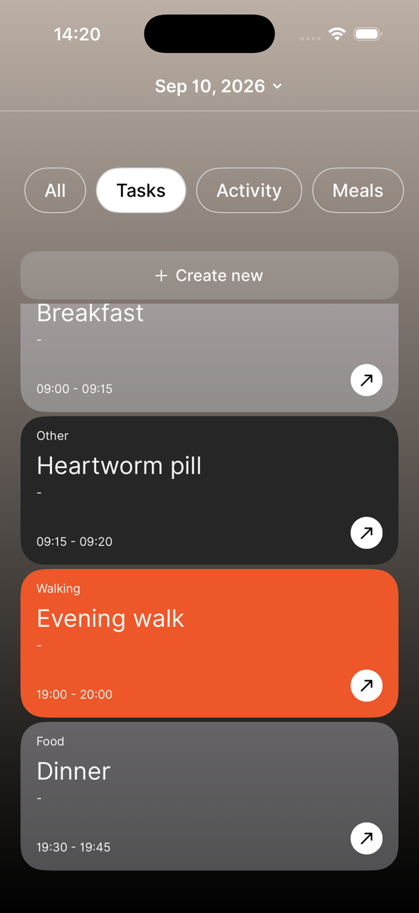 Tasks, expanded | 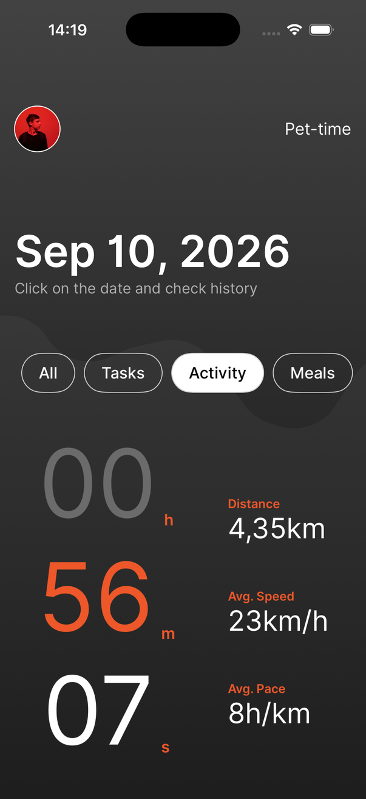 Activity tab |
| 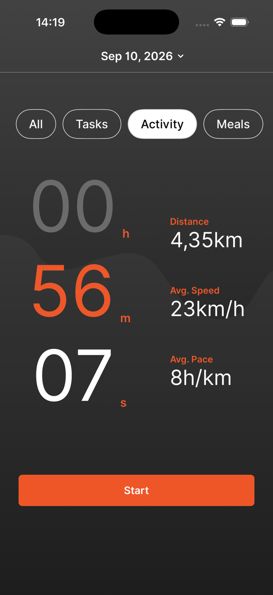 Activity, expanded | 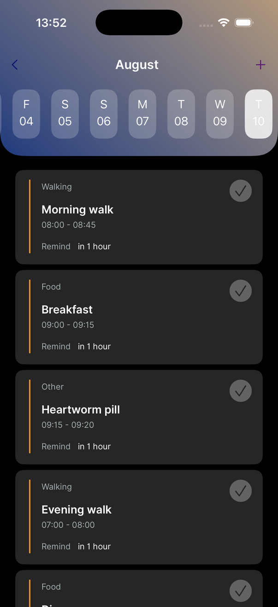 Calendar | 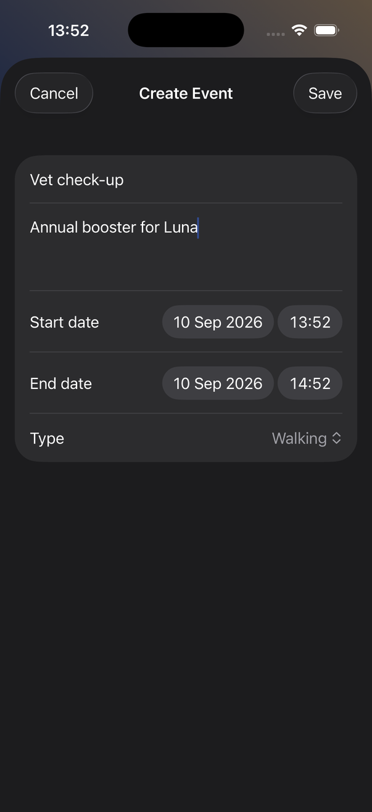 Create event |
|  Activity — today | 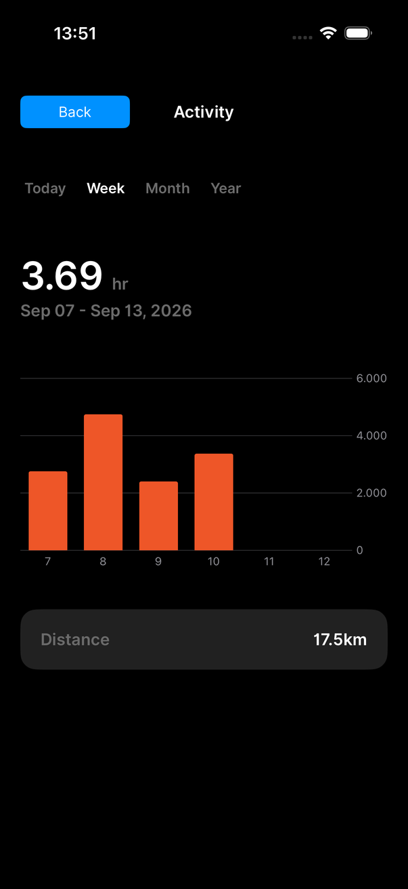 Activity — week | 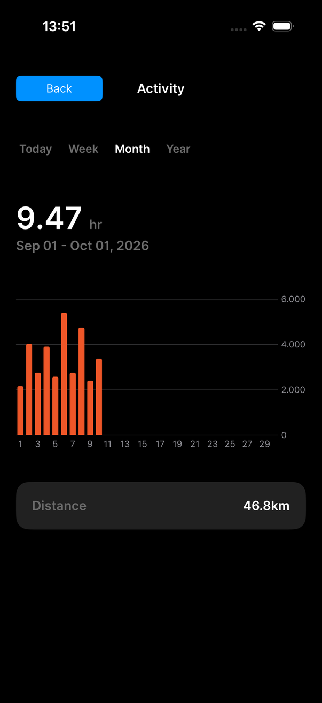 Activity — month |
|  Live walk | 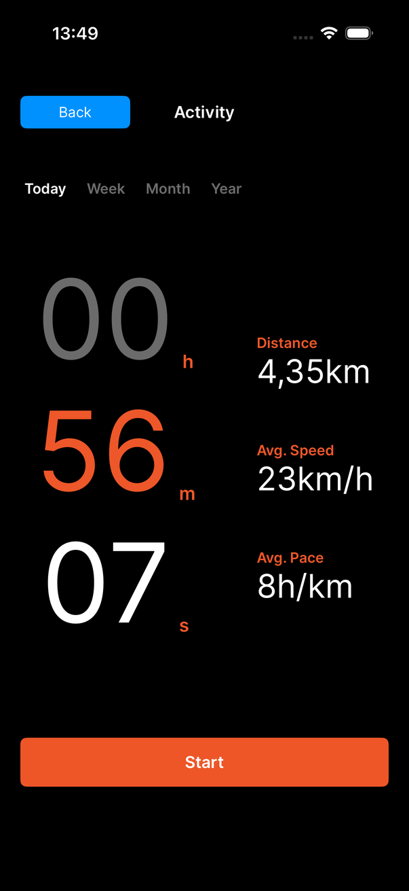 Walk saved |  Pet-time / community |

## Architecture

```
sai/
├── Core/          DI (Resolver), Apollo network stack + auth interceptor, fonts, utils
├── Domain/        Models, repository protocols, services (ActiveWalk, Location, Auth, Notifications)
├── Data/
│   ├── DataSource/GraphqQL   Apollo implementations (generated code lives in SaiFastAPI/)
│   ├── DataSource/DB         CoreData persistence for in-progress walks
│   └── Repository/           Repository implementations combining the sources
├── Presentation/
│   ├── Screens/   Home (sheet + tabs), Calendar, Walks, PetTime, Profile, SignIn, CreateEvent
│   ├── Components/, Navigation/, ViewModels/
└── graphql/       .graphql operations + schema used by apollo-ios-cli codegen
SaiFastAPI/        Generated Apollo package (schema, operations, fragments)
```

Stack: SwiftUI, Swift concurrency, Apollo iOS 1.x, CoreData, CoreLocation, Firebase Auth, Resolver (DI), SwiftUIIntrospect, Popovers. iOS 18+.

## Run it

1. Backend: follow [sai-fastapi](https://github.com/nickspopov/sai-fastapi) — `docker compose -f docker-compose-with-database.yaml up` gives you Postgres + API on `:3000`, or `uvicorn main:app` on `:8000`. The app points at `http://localhost:8000/graphql` (`sai/Core/Network/Network.swift`); ATS already allows plain HTTP to localhost.
2. Firebase: create an iOS app in your Firebase project, download `GoogleService-Info.plist` into `sai/` (gitignored). For local development without Firebase set `SKIP_AUTH=true` on the backend.
3. Open `sai.xcodeproj`, pick your team in Signing (no team is checked in), run on a simulator. In the simulator use *Features → Location → Freeway Drive* or `xcrun simctl location <udid> set <lat>,<lon>` to feed the walk tracker.

Regenerate GraphQL code after schema changes:

```bash
./apollo-ios-cli generate   # uses apollo-codegen-config.json; get the CLI from the Apollo package
```

## License

MIT © Nick Popov
